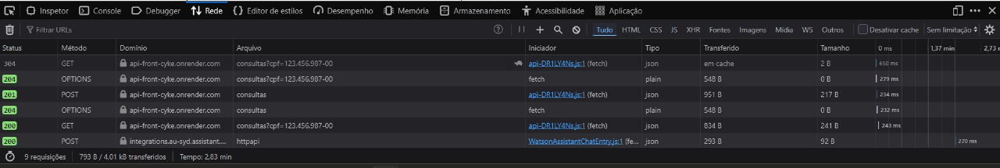
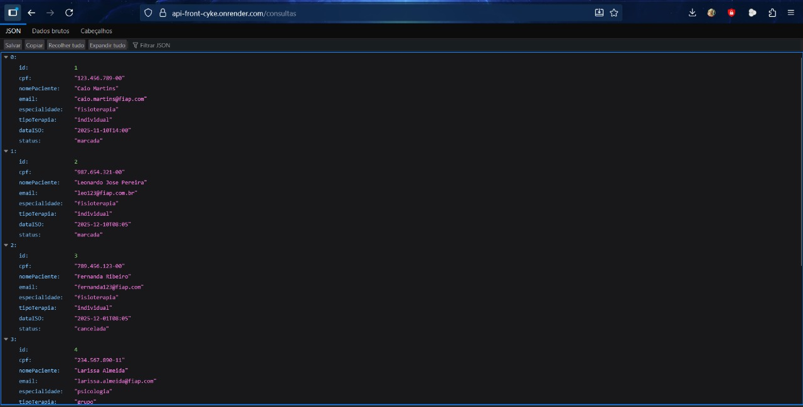
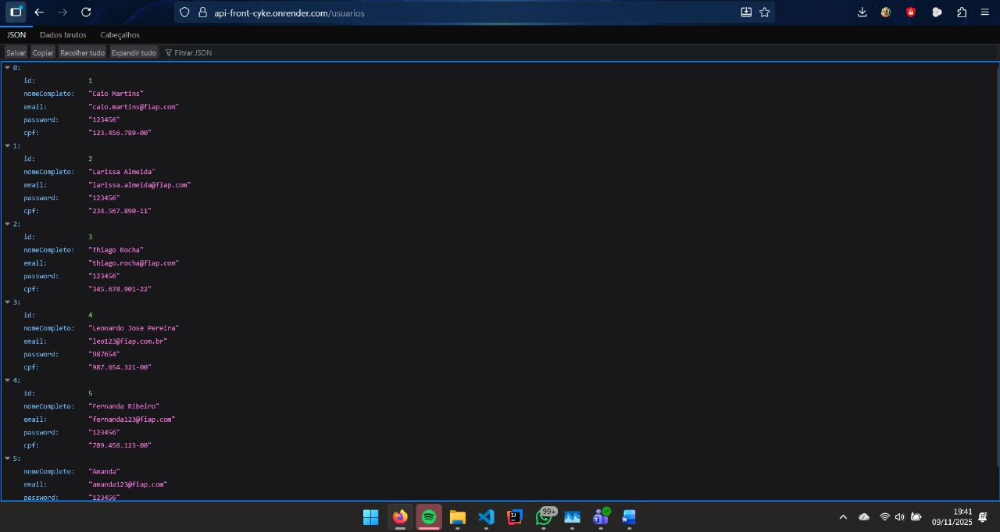

# IMREA Digital — Sprint 4 (Front-end Design Engineering)

Aplicação SPA desenvolvida para o desafio IMREA Digital, com foco em acessibilidade, responsividade e integração ao fluxo de agendamentos do instituto. O front-end foi construído em **React 19 + Vite + TypeScript**, estilizado com **Tailwind CSS 4** e validado com **React Hook Form + Zod**.

## Deploys e repositórios
- Front-end (Vercel): https://sprint-4-front-ywbf.vercel.app/
- API (Render): https://api-front-cyke.onrender.com
- API (Usuarios): https://api-front-cyke.onrender.com/usuarios
- API (consultas): https://api-front-cyke.onrender.com/consultas
- Repositório do front: https://github.com/leojp04/Sprint-4-Front


## Tecnologias principais
- React 19 + Vite 5
- TypeScript 5
- Tailwind CSS 4
- React Router DOM 7
- React Hook Form + Zod
- ESLint (flat config)

## Pré-requisitos
- Node.js 20+ e npm 10+
- `.env` configurado com a URL base da API

## Configuração e execução local
```bash
cd dra-rea
cp .env.example .env       
npm install
npm run dev
```
A aplicação inicializa em `http://localhost:5173`. Para conferir o build de produção:
```bash
npm run build
npm run preview
```

## Scripts úteis
- `npm run dev` — ambiente de desenvolvimento (Vite)
- `npm run build` — build otimizado
- `npm run preview` — serve o build para inspeção local
- `npm run lint` — validação estática

## Integração com a API Java
- Base URL utilizada em produção: `https://api-front-cyke.onrender.com`
- Endpoints consumidos pelo front: `/usuarios`, `/consultas` e variações com query string (`?cpf=` etc.).
- O projeto completo da API está disponível em `leojp04/API-Front` (Java/Spring). O repositório pode ser clonado, executado localmente (perfil default) ou implantado no Render; o front apenas depende de `VITE_API_URL` apontando para a instância desejada.





## Estrutura de pastas (front)
```
src/
  assets/
  components/
  data/
  hooks/
  pages/
  services/
  types/
  App.tsx
  main.tsx
  routes.ts
```

## Integrantes
- **Leonardo José Pereira** — RM **563065** — 1TDSPW  
  GitHub: https://github.com/leojp04 · LinkedIn: https://www.linkedin.com/in/leonardo-pereira-adm
- **Fabricio Henrique Pereira** — RM **563237** — 1TDSPW  
  GitHub: https://github.com/Fabriciopereira-sp · LinkedIn: https://www.linkedin.com/in/fabrício-henrique-pereira-3aa94933b/
- **Ícaro José dos Santos** — RM **562403** — 1TDSPW  
  GitHub: https://github.com/Icaro-Jose09 · LinkedIn: https://www.linkedin.com/in/icaro-jose-jose-96b651324

## Vídeo (≤ 3 min)
https://youtu.be/pY6bD4OwPYY?si=lC52gOV73AJBoqiF
